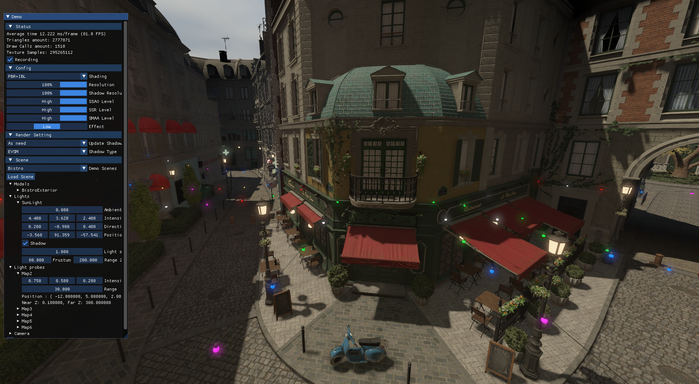
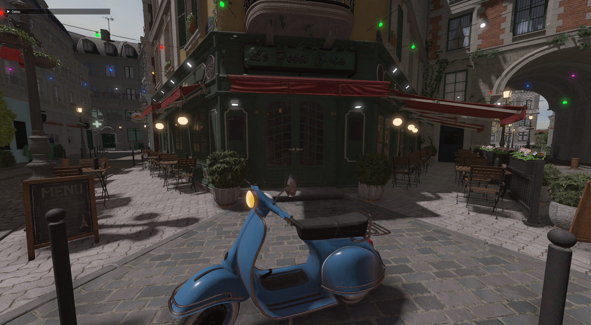
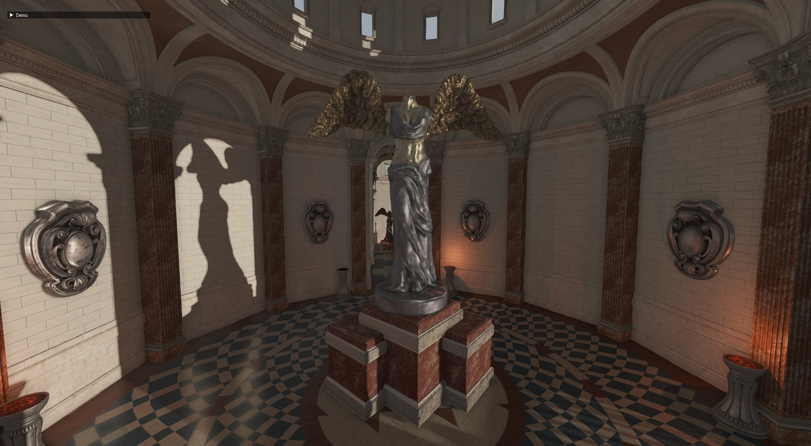
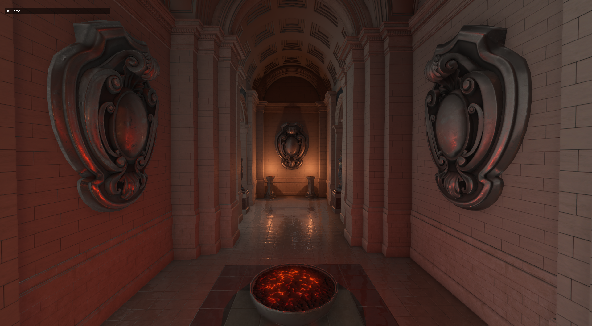

# ConfigurableRenderer

OpenGL实现的一个渲染管线，仿照Nvidia的Falcor。并添加了一些可调节的参数，包括：

| 名称       | 参数           | 取值                   |
| ---------- | -------------- | ---------------------- |
| 分辨率     | 占整个屏幕比例 | 60%, 80%, 100%         |
| Shadow Map | 阴影贴图分辨率 | 512, 1024, 2048        |
| SSAO       | 采样数         | 0, 4, 16               |
| Shading    | 着色模型       | GGX-based PBR, PBR+IBL |
| 反射       | SSR            | Off, On                |
| SMAA抗锯齿 | 查询步数       | 0, 4, 32               |

## Demo

## Dependency

- glfw3
- assimp
- nanogui
- jsonxx

## Test Scenes

- SunTemple: 
  - 从nvidia官网上下载SunTemple模型数据包[下载地址](https://developer.nvidia.com/sun-temple)
  - 将resources下的SunTemple文件夹与模型文件夹合并
- Bistro:
  - 从nvidia官网上下载Bistro模型数据包[下载地址](https://developer.nvidia.com/bistro)
  - 将resources下的Bistro文件夹与模型文件夹合并